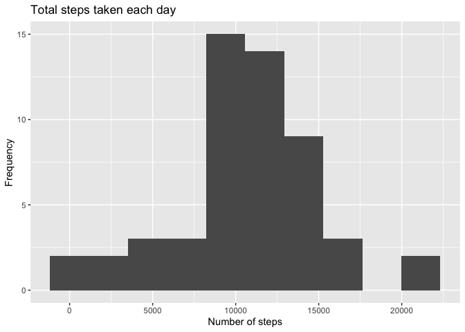
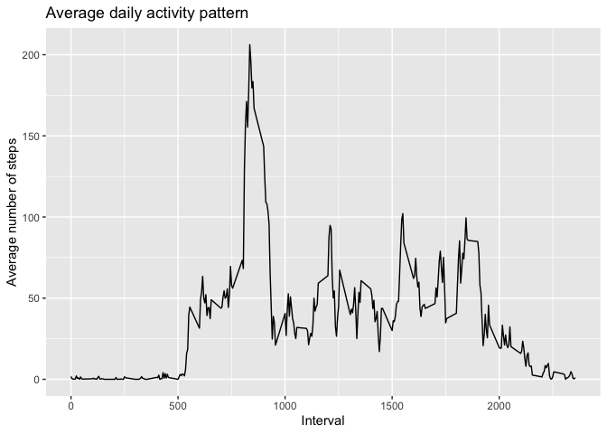
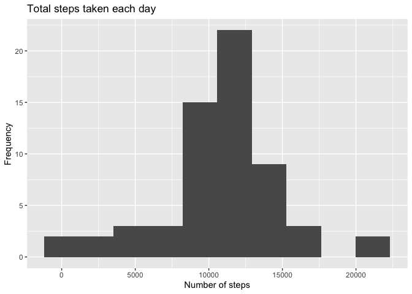
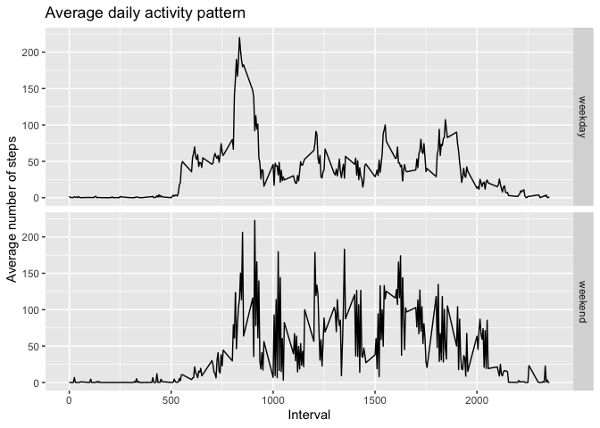

==========================================================================================================================================

## Loading and preprocessing the data

Libraries

```r
library(tidyverse)
library(magrittr)
library(rmarkdown)
```

Unzip file and load csv

```r
unzip("activity.zip")

df_activity <- read.csv("activity.csv") %>% as_tibble()
```

Convert dates to datetime class

```r
df_activity %<>%  mutate(date = as.Date(date, format = "%Y-%m-%d"))
```

## What is mean total number of steps taken per day?

Calculate total steps by day

```r
df_steps <- df_activity %>% 
       group_by(date) %>% 
       summarise(total_steps = sum(steps, na.rm = FALSE))
```

Plot histogram

```r
df_steps %>% ggplot(aes(total_steps)) +
       geom_histogram(bins = 10) +
       ggtitle("Total steps taken each day") +
       xlab("Number of steps") +
       ylab("Frequency")
```

<!-- -->
     
Mean and median of total steps taken per day      

```r
summary(df_steps$total_steps)
```

```
##    Min. 1st Qu.  Median    Mean 3rd Qu.    Max.    NA's 
##      41    8841   10765   10766   13294   21194       8
```

## What is the average daily activity pattern?

Calculate the average number of steps for each interval

```r
df_daily <- df_activity %>%
       group_by(interval) %>% 
       summarise(average_steps = mean(steps, na.rm = TRUE))
```

Create a time series plot to show average daily activity

```r
df_daily %>% ggplot(aes(x = interval, y = average_steps)) +
       geom_line() +
       ggtitle("Average daily activity pattern") +
       xlab("Interval") +
       ylab("Average number of steps")
```

<!-- -->

Find the interval with the maximum average number of steps

```r
df_daily[which.max(df_daily$average_steps),]
```

```
## # A tibble: 1 x 2
##   interval average_steps
##      <int>         <dbl>
## 1      835          206.
```

## Imputing missing values

Calculate the total number of missing values

```r
sum(is.na(df_activity$steps))
```

```
## [1] 2304
```

Fill in missing values using the average for that time interval

```r
df_impute <- df_activity %>% 
       left_join(df_daily, by = "interval") %>% 
       mutate(steps = as.numeric(steps))

df_impute[is.na(df_impute$steps), "steps"] <- df_impute[is.na(df_impute$steps), "average_steps"]
```

Create a histogram of the total number of steps taken each day

```r
df_impute_steps <- df_impute %>%
       group_by(date) %>% 
       summarise(total_steps = sum(steps))

df_impute_steps %>% ggplot(aes(total_steps)) +
       geom_histogram(bins = 10) +
       ggtitle("Total steps taken each day") +
       xlab("Number of steps") +
       ylab("Frequency")
```

<!-- -->

Calculate the mean and median of the imputed data

```r
summary(df_impute_steps$total_steps)
```

```
##    Min. 1st Qu.  Median    Mean 3rd Qu.    Max. 
##      41    9819   10766   10766   12811   21194
```
The mean and median are almost exactly the same

## Are there differences in activity patterns between weekdays and weekends?

Assign weekend or weekday to each date

```r
df_day <- df_impute %>% 
       mutate(day = weekdays(df_impute$date)) %>% 
       mutate(day_cat = ifelse(day == c("Saturday", "Sunday"), "weekend", "weekday"))
```

Create time series plots to show average daily activity on weekdays vs weekends

```r
df_day_steps <- df_day %>% 
       group_by(interval, day_cat) %>% 
       summarise(average_steps = mean(steps))

df_day_steps %>% ggplot(aes(x = interval, y = average_steps)) +
       geom_line() +
       facet_grid(rows = vars(day_cat)) +
       ggtitle("Average daily activity pattern") +
       xlab("Interval") +
       ylab("Average number of steps")
```

<!-- -->


